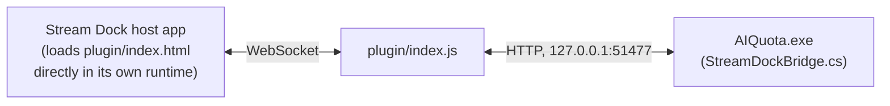

# AIQuota Stream Dock plugin

Shows AIQuota's session/weekly/credit usage on a key of a Stream Dock-protocol
controller (Soomfon "Stream Controller", Ajazz, Mirabox, ... - these are the
same hardware/software family under different brands) and refreshes AIQuota
when that key is pressed.

## How it works



- AIQuota renders the same bars/ring it already draws for the tray icon as a
  200x200 PNG and serves it, plus the raw percentages, from a small
  loopback-only HTTP endpoint (`GET /status`) - see
  [`AIQuota/StreamDock/StreamDockBridge.cs`](../AIQuota/StreamDock/StreamDockBridge.cs).
  A `POST /refresh` there triggers the same refresh the tray's "Refresh now"
  menu entry does.
- This is a normal Stream Dock JavaScript plugin (per the
  [official SDK](https://github.com/MiraboxSpace/StreamDock-Plugin-SDK) /
  [docs](https://sdk.key123.vip/en/)): `manifest.json`'s `CodePath` points at
  `plugin/index.html`, which the Stream Dock host loads directly inside its
  own embedded runtime - there's no separate executable or build step. The
  plugin's JS (`plugin/index.js`) polls `/status` every 4 seconds while its
  key is visible and pushes the image it gets back onto the key via
  `setImage`, and calls `/refresh` on `keyDown`, using the bundled `axios`
  HTTP client (`plugin/utils/axios.js`, vendored from the SDK's own
  template).
- The two only talk to each other via `127.0.0.1` - no pairing, no vendor
  HID/USB protocol, no Companion/OpenDeck middleware.

In AIQuota, enable the bridge from the tray menu: **"Show on Stream Dock
controller"** (off by default, since it opens a local port).

## Setup

1. In AIQuota's tray menu, enable **"Show on Stream Dock controller"**.
2. Copy the whole `eu.schicht8.aiquota.sdPlugin` folder as-is into the Stream
   Dock host app's plugin directory (no build step - it's plain JS/HTML):
   ```
   %AppData%\HotSpot\StreamDock\plugins\
   ```
3. Restart the Stream Dock host app (it only scans the plugins folder on
   startup). The action shows up as "AIQuota" / "Claude Usage" in its action
   list - drag it onto a key.

## Known caveats

- Only verified against the publicly documented protocol (registration
  handshake, `willAppear`/`willDisappear`/`keyDown`, `setImage`), not against
  a physical Soomfon "Stream Controller Classic" - I don't have one to test
  end-to-end. If the key doesn't update, open the host app's plugin debug
  console at `http://localhost:23519/` and check this plugin's log output.
- The bridge's port (51477) is fixed and shared between
  `StreamDockBridge.cs` and `plugin/index.js` - if you change one, change
  the other.
- `plugin/utils/common.js`, `plugin/utils/worker.js` and
  `plugin/utils/axios.js` are vendored verbatim from the SDK's own
  [JavaScript plugin template](https://github.com/MiraboxSpace/StreamDock-Plugin-SDK/tree/main/SDJavaScriptSDK/com.mirabox.streamdock.xxx.sdPlugin) -
  don't hand-edit them, re-fetch from there instead if the SDK updates.
